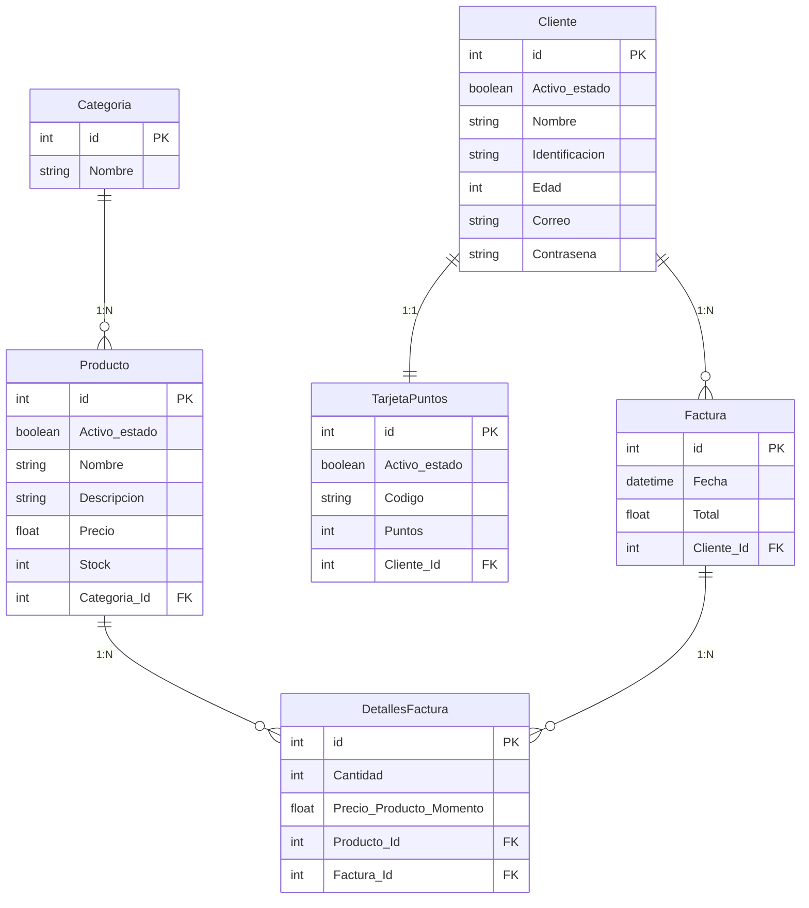

# Sistema de Gestión de Inventario y Facturación

Este proyecto es una API REST robusta desarrollada con **Spring Boot** para la gestión integral de un sistema de inventario, clientes y facturación. Se enfoca en la eficiencia lógica y la integridad de los datos, garantizando una trazabilidad completa desde el producto hasta la generación de la factura.

## Tecnologías y Dependencias
* **Java 25**.
* **Spring Boot 4.0.5**.
* **Spring Data JPA**: Para la persistencia de datos y mapeo ORM.
* **Spring Web**: Construcción de Endpoints RESTful.
* **MySQL Driver**: Conector para la base de datos relacional.
* **Lombok**: Para la reducción de código boilerplate (Getters, Setters, etc.).
* **Swagger/OpenAPI**: Documentación interactiva de la API.
* **JUnit 5 & Mockito**: Pruebas unitarias con cobertura del 100% en la capa de servicios.

## Arquitectura de Base de Datos
El sistema utiliza una base de datos relacional con la siguiente estructura de entidades:



## Estructura del Proyecto
El proyecto sigue un patrón de diseño por capas para asegurar el bajo acoplamiento:
* **`config`**: Configuraciones globales (Swagger).
* **`controller`**: Puntos de entrada de la API.
* **`service`**: Lógica de negocio (Refactorizada y optimizada).
* **`repository`**: Interfaces para comunicación con la BD.
* **`model`**: Entidades JPA.
* **`dto`**: Objetos de transferencia de datos para seguridad y limpieza de la API.
* **`exception`**: Manejo global de errores y excepciones personalizadas.

## Calidad y Testing
Se ha hecho un énfasis especial en la fiabilidad del sistema:
* **Cobertura de Código**: 100% en la capa de `Service` (Line & Branch Coverage).
* **Escenarios Probados**:
    * Flujos complejos de creación de facturas con múltiples detalles.
    * Validación y actualización de stock en tiempo real.
    * Manejo de excepciones (Stock insuficiente, recursos no encontrados).
    * Lógica defensiva contra datos nulos o vacíos.

## ⚙️ Configuración Local
Para correr el proyecto localmente, asegúrate de tener una instancia de MySQL y configurar el archivo `application.properties`:

```properties
spring.datasource.url=jdbc:mysql://localhost:3306/inventoryGestion?createDatabaseIfNotExist=true
spring.datasource.username=tu_usuario
spring.datasource.password=tu_contrasena
spring.jpa.hibernate.ddl-auto=update
```

## Ejecución
1. Clonar el repositorio.
2. Ejecutar `mvn clean install` para descargar dependencias.
3. Correr la aplicación con `mvn spring-boot:run`.
4. Acceder a la documentación de Swagger en: `http://localhost:8080/swagger-ui.html` (o la ruta configurada).

---

¡Este documento te hará ver como un profesional ante los reclutadores del Éxito! ¿Necesitas que detallemos algún endpoint específico?
